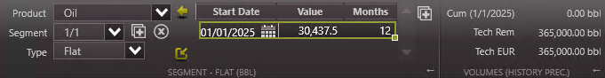
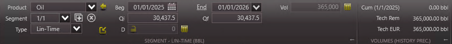
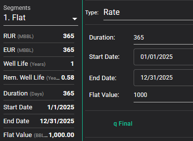
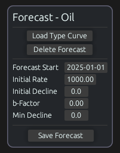

# Flat

## Description

Test how simple flat segments are calculated across each tool.

- Create a production forecast for oil.
- Add a flat segment with these parameters:
  - Start date of 01/01/2025
    - Note: intentionally *not* a leap year
  - Duration ($t$) of 1 year
    - Note: if the tool doesn't allow duration to be provided as years, try to provide it either as 12 months, or 365.25 days
  - Rate ($q$) of 1000 bbl/d

## Results

### Baseline

We expect the volume for this segment to be calculated with:

```math
\begin{aligned}
Q_t(t) &= qt \\
Q_f &= (1000)(365.25) \\
&= 365,250 \text{ bbl}
\end{aligned}
```

**Expected Volume: 365,250 bbl**

### ARIES

### PHDwin v3



Flat segments are entered as monthly values, so we use a rate of $(1000)(365.25/12)=30437.5 \text{ bbl/mo}$ for 12 months.

This gives a volume of 365,000 bbl, which suggests that whole calendar months are used instead of average months. This was confirmed by trying to select another start date partway through the month, but the first of the month is automatically selected.

It's also possible to model this in PHDwin as a linear segment with constant initial and final rates. This gives the same result because the end date is a calendar date, or a year duration that appears to round to the nearest calendar date.



**Actual Volume: 365,000 bbl**

### ComboCurve



It seems that ComboCurve only allows whole numbers to be used as the duration for flat segments, so a duration of 365 days was used instead of 365.25 days.

This duration difference caused the volume to be different ($1000 * 365 = 365,000$).

**Actual Volume: 365,000 bbl**

### whitson+

### Val Nav

### Mosaic

### 4cast

### Harmony

### Obsidian



Obsidian uses implicit forecast cutoffs, so a flat curve was used with 1 year of monthly values summed up to get the total volume.

As Obsidian uses actual calender days, the total volume for 2025 is (1000 bbl/d * 365 days) = 365,000 bbl.

**Actual Volume: 365,000 bbl**
