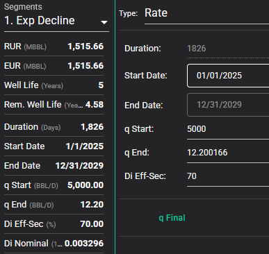
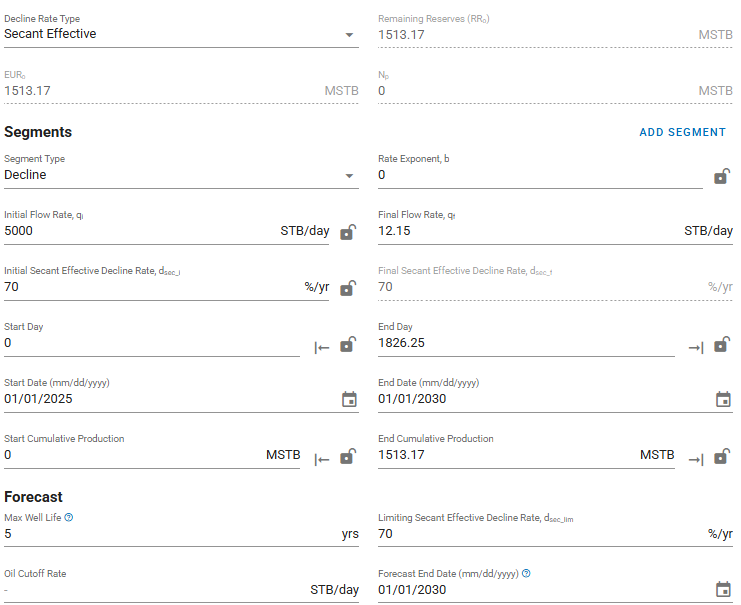
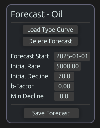

# Exponential

## Description

Test how simple exponential segments are calculated across each tool.

- Create a production forecast for oil.
- Add an exponential segment with these parameters:
  - Start date of 01/01/2025
  - Duration ($t$) of 5 years
    - Note: if the tool doesn't allow duration to be provided in years, try to provide it either as 60 months, or 1826.25 days
  - Initial rate ($q_i$) of 5000 bbl/d
    - Note: this rate is intentionally extreme so we can spot small variances in final rate and decline rate calculations
  - Initial effective decline rate ($D_e$) of 70 %/yr

## Results

### Baseline

Convert the initial decline rate to nominal:

```math
\begin{aligned}
D &= -ln(1 - D_e)\\
&= -ln(1 - 0.7)\\
&\approx 120.3972804 \text{ \%/yr}\\
\end{aligned}
```

We can change the unit of the nominal decline rate to %/d by using the average year length of 365.25:

```math
\begin{aligned}
D &\approx 120.3972804 \text{ \%/yr}\\
&\approx (120.3972804 \text{ \%/yr})\frac{1 \text{ yr}}{365.25 \text{ d}}\\
&\approx 0.329629789 \text{ \%/d}
\end{aligned}
```

We expect the volume for this segment to be calculated with:

```math
\begin{aligned}
Q_t(t) &= \frac{q_i}{D}(1-e^{-Dt})\\
Q_f &\approx \frac{5000}{0.00329629789}(1-e^{-(0.00329629789)(5)(365.25)})\\
&\approx 1,513,167.196 \text{ bbl}
\end{aligned}
```

**Expected Volume: 1,513,167.246 bbl**

### ARIES

```
5000 X B/D 60 MO EXP 70
```

ARIES only allows whole numbers to be used as the duration, so 60 months (`60 MO` or the equivalent `5 YR`) is used instead. ARIES assumes an average of 365 days per year, so the total days after 5 years are $5 * 365 = 1825$.

The average year length of 365 days also affects the decline rate.

To reproduce the ARIES calculation, calculate the nominal decline rate in the same way as the baseline but using 365 days per year instead:


```math
\begin{aligned}
D &\approx 120.3972804 \text{ \%/yr}\\
&\approx (120.3972804 \text{ \%/yr})\frac{1 \text{ yr}}{365 \text{ d}}\\
&\approx 0.3298556 \text{ \%/d}
\end{aligned}
```

Then calculate the volume after 1825 days:

```math
\begin{aligned}
Q_f &\approx \frac{5000}{0.003298556}(1-e^{-(0.003298556)(1825)})\\
&\approx 1,512,131.539 \text{ bbl}
\end{aligned}
```

This is approximately the same as the ARIES actual volume, with the remaining difference likely to be caused by a small amount of floating-point error accumulation.

**Actual Volume: 1,512,131.75 bbl**

### PHDwin v3


Monthly production rates are used, so the initial rate becomes $(5000)(365.25/12)=152187.5 \text{ bbl/mo}$.

PHDwin doesn't appear to allow fractional durations to be used, so 1826 days is used instead. If we use 1826 days to re-calculate the equation used in the baseline, the result is $\frac{5000}{0.00329629789}(1-e^{-(0.00329629789)(1826)})\approx1,513,164.207 \text { bbl}$ as expected, so the change in duration is the only reason for the variance.

**Actual Volume: 1,513,164.21 bbl**

### ComboCurve



It seems that ComboCurve only allows whole numbers to be used as the duration for exponential segments, so a duration of 1826 days was used instead of 1826.25 days. However the duration difference doesn't explain the difference in volume in this case, because the ComboCurve volume is significantly higher (~1515.66 mbbl vs. ~1513.17 mbbl).

To understand why the volume is higher, we analyzed the daily rates being used and compared it to the daily volumes. We noticed that the daily rate seemed to have the same value as the daily volume for each day. In other words, the instantaneous rate at the start of each day ($q_t$) is held flat across the day.

If we sum the ComboCurve daily rates across the entire period, the total is approximately 1515659.497 bbl, which appears to match the volume displayed in the ComboCurve user interface for this forecast. This accounts for the difference in volume.

Note that holding the instantaneous rate at the start of each day flat across the day will cause volumes to be larger than the typical volume equations (i.e., $Q_t$). The effect could be significant for higher decline rates.

**Actual Volume: 1,515,660 bbl**

### whitson+



The remaining difference from the baseline seems to be rounding to the displayed decimal places.

**Actual Volume: 1,513,170 bbl**

### Val Nav

### Mosaic

### 4cast

### Harmony

### Obsidian



Obsidian uses implicit forecast cutoffs, so an exponential curve was used with 5 years of monthly values summed up to get the total volume.

As Obsidian uses actual calender days, 5 years results in a duration of 1826 days.  The total volume of 1,515,660 bbl differs from the baseline calculation due to the use of initial daily rates as the daily volumes (rather than declining within a given day).

**Actual Volume: 1,515,660 bbl**
