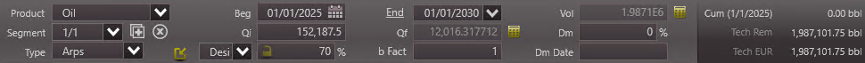

# Harmonic

## Description

Test how simple harmonic segments are calculated across each tool.

- Create a production forecast for oil.
- Add a linear segment with these parameters:
  - Start date of 01/01/2025
  - Duration ($t$) of 5 years
    - Note: if the tool doesn't allow duration to be provided in years, try to provide it either as 60 months, or 1826.25 days
  - Initial rate ($q_i$) of 5000 bbl/d
    - Note: this rate is intentionally extreme so we can spot small variances in final rate and decline rate calculations
  - Initial secant effective decline rate ($D_{esi}$) of 70 %/yr

## Results

### Baseline

Convert the initial decline rate to nominal:

```math
\begin{aligned}
D_i &= \frac{(1 - D_{esi})^{-b}-1}{b}\\
&= \frac{(1 - 0.7)^{-1}-1}{1}\\
&\approx 233.3333333 \%/yr
\end{aligned}
```

We can change the unit of the nominal decline rate to %/d by using the average year length of 365.25:

```math
\begin{aligned}
D &\approx 233.3333333 \text{ \%/yr}\\
&\approx (233.3333333 \text{ \%/yr})\frac{1 \text{ yr}}{365.25 \text{ d}}\\
&\approx 0.63883185 \text{ \%/d}
\end{aligned}
```

We expect the volume for this segment to be calculated with:

```math
\begin{aligned}
Q_t(t) &= \frac{q_i}{D_i}ln(1+D_it)\\
&= \frac{5000}{0.0063883185}ln(1+(0.0063883185)(5)(365.25))\\
&\approx 1,987,200.443 \text{ bbl}
\end{aligned}
```

**Expected Volume: 1,987,200.443 bbl**

### ARIES

```
5000 X B/D 5 YRS B/1 70
```

The harmonic forecast uses a B-factor of 1 with `B/1 Desi`, which should be equivalent to `HAR Desi`.

ARIES only allows whole numbers to be used as the duration, so 60 months (`60 MO` or the equivalent `5 YR`) is used instead. ARIES assumes an average of 365 days per year, so the total days after 5 years are $5 * 365 = 1825$.

The average year length of 365 days also affects the decline rate.

To reproduce the ARIES calculation, calculate the nominal decline rate in the same way as the baseline but using 365 days per year instead:

```math
\begin{aligned}
D &\approx 233.3333333 \text{ \%/yr}\\
&\approx (233.3333333 \text{ \%/yr})\frac{1 \text{ yr}}{365 \text{ d}}\\
&\approx 0.639269406 \text{ \%/d}
\end{aligned}
```

Then calculate the volume after 1825 days:

```math
\begin{aligned}
Q_f &= \frac{5000}{0.00639269406}ln(1+(0.00639269406)(1825))\\
&\approx 1,985,840.278 \text{ bbl}
\end{aligned}
```

The remaining difference seems to be significant. It might be explained by rounding intermediate calculations, difference in the natural log calculation, or floating-point error accumulation, but it would be useful to reproduce the exact difference if anyone would like to explore this more. The calculation is very sensitive to decline rate and duration precision, so small differences could easily cause the remaining difference.

**Actual Volume: 1,985,771.54 bbl**

### PHDwin v3



Monthly production rates are used, so the initial rate becomes $(5000)(365.25/12)=152187.5 \text{ bbl/mo}$.

PHDwin doesn't appear to allow fractional durations to be used, so 1826 days is used instead. If we use 365 days to re-calculate the equation used in the baseline, the result is $\frac{5000}{0.0063883185}ln(1+(0.0063883185)(1826))\approx1,987,101.753 \text { bbl}$ as expected, so the change in duration is the only reason for the variance.

**Actual Volume: 1,987,101.75 bbl**

### ComboCurve

(TODO: screenshot)

It seems that ComboCurve only allows whole numbers to be used as the duration for exponential segments, so a duration of 1826 days was used instead of 1826.25 days. However the duration difference doesn't explain the difference in volume in this case, because the ComboCurve volume is significantly higher (~1.989 mbbl vs. ~1.987 mbbl).

Similar to the [exponential simple case](./../03-exponential-simple/README.md), ComboCurve appears to sum daily rates in order to calculate cumulative volume. This was confirmed by comparing the daily rates from the ComboCurve user interface to daily volumes exported through the ComboCurve API. Summing either the daily rates or daily volumes will result in the total of ~1.989 mbbl displayed in the ComboCurve user interface.

Because of the curvature of harmonic segments, volumes may be higher or lower than the volume calculated using the equation described in the baseline. The effect on the volume can be more significant depending on the decline rate.

**Actual Volume: 1,989,410 bbl**

### whitson+

### Val Nav

### Mosaic

### 4cast

### Harmony
