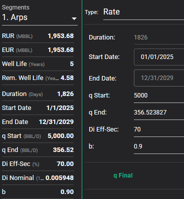

# Hyperbolic

## Description

Test how simple hyperbolic segments are calculated across each tool.

- Create a production forecast for oil.
- Add a hyperbolic segment with these parameters:
  - Start date of 01/01/2025
  - Duration ($t$) of 5 years
    - Note: if the tool doesn't allow duration to be provided in years, try to provide it either as 60 months, or 1826.25 days
  - Initial rate ($q_i$) of 5000 bbl/d
    - Note: this rate is intentionally extreme so we can spot small variances in final rate and decline rate calculations
  - Initial decline rate ($D_e$, i.e., effective initial decline rate) of 70 %/yr
  - Exponent ($b$) of 0.9

## Results

### Baseline

Convert the initial decline rate to nominal:

```math
\begin{aligned}
D_i &= \frac{(1 - D_{esi})^{-b}-1}{b}\\
&= \frac{(1 - 0.7)^{-0.9}-1}{0.9}\\
&\approx 217.2474632 \%/yr
\end{aligned}
```

We can change the unit of the nominal decline rate to %/d by using the average year length of 365.25:

```math
\begin{aligned}
D &\approx 217.2474632 \text{ \%/yr}\\
&\approx (217.2474632 \text{ \%/yr})\frac{1 \text{ yr}}{365.25 \text{ d}}\\
&\approx 0.594791138 \text{ \%/d}
\end{aligned}
```

We expect the volume for this segment to be calculated with:

```math
\begin{aligned}
Q_t(t) &= \frac{q_i}{D_i(1-b)}[1-(1+bD_it)^{\frac{b-1}{b}}]\\
&= \frac{5000}{(0.00594791138)(1-0.9)}[1-(1+(0.9)(0.00594791138)(5)(365.25))^{\frac{0.9-1}{0.9}}]\\
&\approx 1,951,443.722 \text{ bbl}
\end{aligned}
```

**Expected Volume: 1,951,443.722 bbl**

### ARIES

### PHDwin v3


Monthly production rates are used, so the initial rate becomes $(5000)(365.25/12)=152187.5 \text{ bbl/mo}$.

PHDwin doesn't appear to allow fractional durations to be used, so 1826 days is used instead. If we use 365 days to re-calculate the equation used in the baseline, the result is $\frac{5000}{(0.00594791138)(1-0.9)}[1-(1+(0.9)(0.00594791138)(1826))^{\frac{0.9-1}{0.9}}]\approx1,951,354.647 \text { bbl}$ as expected, so the change in duration is the only reason for the variance.

**Actual Volume: 1,951,354.65 bbl**

### ComboCurve



It seems that ComboCurve only allows whole numbers to be used as the duration for exponential segments, so a duration of 1826 days was used instead of 1826.25 days. However the duration difference doesn't explain the difference in volume in this case, because the ComboCurve volume is significantly higher (~1.954 mbbl vs. ~1.951 mbbl).

Similar to the [exponential simple case](./../03-exponential-simple/README.md), ComboCurve appears to sum daily rates in order to calculate cumulative volume. This was confirmed by comparing the daily rates from the ComboCurve user interface to daily volumes exported through the ComboCurve API. Summing either the daily rates or daily volumes will result in the total of ~1.954 mbbl displayed in the ComboCurve user interface.

Because of the curvature of hyperbolic segments, volumes may be higher or lower than the volume calculated using the equation described in the baseline. The effect on the volume can be more significant depending on the decline rate.

**Actual Volume: 1,953,680 bbl**

### whitson+

### Val Nav

### Mosaic

### 4cast

### Harmony
