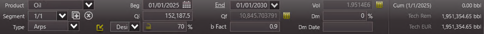
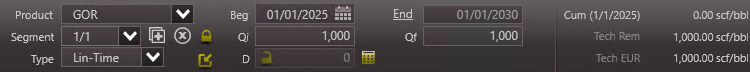
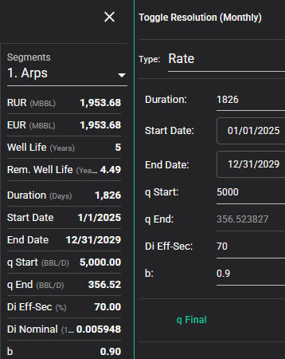
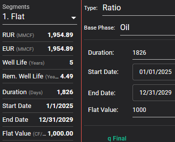

# Flat Ratio Against Hyperbolic

## Description

Test how simple flat ratio segments are calculated across each tool. This builds on top of an oil forecast with the same configuration as
[Hyperbolic Simple](./../05-hyperbolic-simple/README.md).

- Create a production forecast for oil.
- Add a hyperbolic segment for oil with these parameters:
  - Start date of 01/01/2025
  - Duration ($t$) of 5 years
    - Note: if the tool doesn't allow duration to be provided in years, try to provide it either as 60 months, or 1826.25 days
  - Initial rate ($q_{oil,i}$) of 5000 bbl/d
  - Initial decline rate ($D_e$, i.e., effective initial decline rate) of 70 %/yr
  - Exponent ($b$) of 0.9
- Create a production forecast for gas as a ratio against oil.
- Add a flat segment for gas with these parameters:
  - Start date of 01/01/2025
  - Duration ($t$) of 5 years
  - Ratio ($q_{gas}$) of 1 mcf/bbl

## Results

### Baseline

### PHDwin v3

Oil

Gas-oil ratio

Gas

### ComboCurve

Oil

Gas

